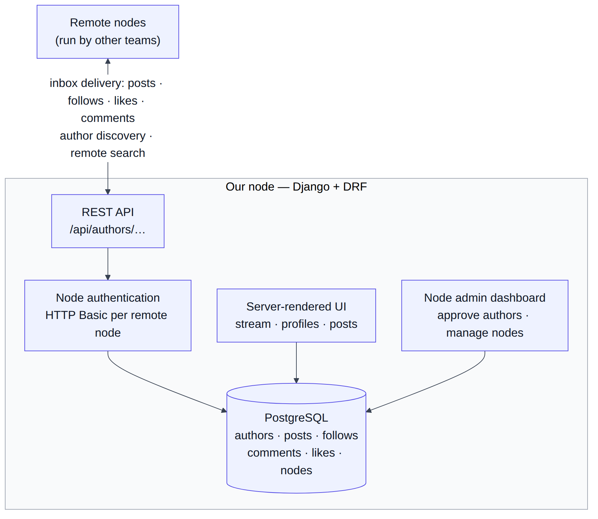

# Social Distribution — Federated Social Network

A federated social networking platform. Independent Django servers ("nodes") exchange authors, posts, follows, comments and likes over a shared REST API. Users on different servers can follow each other and see each other's content, with public, unlisted and friends-only visibility enforced across node boundaries.

[](https://github.com/DbugDiver/social-distribution-platform/actions/workflows/ci.yml)

**[▶ Demo video](Demo.mp4)** · Team project (5 developers) · Django · Django REST Framework · PostgreSQL

## Overview

Most social apps are a single service with a single database. Here, every team runs its own node, and nodes interoperate through a common API specification, much like ActivityPub-style federation. That creates problems a single-server app never has:

- **Identity across servers.** An author is identified by a fully qualified URL (FQID), not a local primary key. Every view must handle both local authors and cached remote authors.
- **Visibility across trust boundaries.** A friends-only post must reach a remote friend's inbox without being exposed to anyone else.
- **Node-to-node authentication.** Nodes authenticate each other with HTTP Basic credentials that a node administrator can enable, disable or revoke.
- **Inbox-based delivery.** Posts, follow requests, likes and comments are pushed to remote authors' inboxes. Remote objects are stored locally with their origin IDs so they can be displayed and deduplicated.

## Architecture

<p align="center">
  
</p>

<sub>Diagram source: [`docs/architecture.mmd`](docs/architecture.mmd)</sub>

| App | Responsibility |
|---|---|
| `authors` | Author model and profiles, follow / follow-request / friend relationships, inbox, author API |
| `posts` | Posts (entries), comments, likes, stream and friends feed, visibility rules, entries API |
| `node` | Node registry, node-to-node authentication, admin dashboard for approving authors and managing remote nodes |

## Features

- **Visibility:** public, unlisted (link-only) and friends-only posts.
- **Social graph:** follow requests with accept/reject, followers, following and friends (mutual follows), both local and remote.
- **Federation:** inbox delivery to remote authors, remote author search, and remote comments and likes stored with their origin IDs.
- **Content:** plain-text and Markdown posts with image attachments, stored on Cloudinary in production.
- **Node administration:** new sign-ups need admin approval, and admins can add, enable or disable remote nodes and manage authors.
- **REST API:** paginated author and entry endpoints that follow the shared cross-team specification.

## My Contributions

This was a five-person team project. The areas I owned:

- **Post visibility.** Public, unlisted and friends-only access rules, link-based access to unlisted posts, and the tests covering them.
- **Node administration app.** Admin dashboard, author approval flow, and remote node management.
- **Follow system and author API.** Followers, follow requests, following and friends endpoints; author API pagination; consolidating API routes under `/api/authors/`.
- **Federation.** Remote author search, inbox handling, and debugging follow and like propagation between nodes.
- **Test suite and CI.** After the project ended, I restored the test suite, which had been disabled. I updated stale tests to the final API, fixed the bugs they exposed, and added GitHub Actions CI.

Git history from the original team repository is preserved, with every contributor's commits intact.

## Testing

66 Django tests across the three apps, run on every push by [GitHub Actions](.github/workflows/ci.yml):

| App | Tests | Covers |
|---|---:|---|
| `authors` | 14 | identity, profiles, follow / accept / reject / unfollow / friends API |
| `posts` | 44 | visibility rules, stream, comments and likes API, pagination, deleted-post handling, remote payloads |
| `node` | 8 | sign-up approval, node creation, admin author management |

Restoring the suite surfaced and fixed several real bugs:

- A helper function accidentally left inside a string literal made every inbound remote comment or like return a **500**.
- The comment detail and comment likes endpoints ignored a route parameter and crashed on every request.
- Remote comment and like serialization assumed remote author IDs were UUIDs.
- Following a local author through the API created a phantom "remote" author record.

## Getting Started

```bash
python3 -m venv .venv && source .venv/bin/activate   # Python 3.12+
pip install -r requirements.txt
export DEBUG=1
python manage.py migrate
python manage.py createsuperuser
python manage.py runserver
```

Run the tests:

```bash
python manage.py test authors posts node -v 2
```

Production settings are read from the environment: `DATABASE_URL`, `SECRET_KEY`, `ALLOWED_HOSTS`, `SITE_URL` and the Cloudinary credentials. The `Procfile` runs migrations on release and serves the app with Gunicorn and WhiteNoise.

## Known Limitations

This was built as a course-scale system. Before real-world use it would need:

- node credentials hashed at rest instead of stored in plaintext;
- a real friendship check on the entry detail API for friends-only posts;
- ownership checks on the follow and friend endpoints, so a user can only act as their own author;
- inbound remote comments and likes tied to an authenticated node;
- verbose request logging removed.

## Team

Rosy Budhathoki, Gui Carius, Manas Joshi, Nathan Rodrigues, and Bir Parkash ([@DbugDiver](https://github.com/DbugDiver)).

## License

[MIT](LICENSE)
